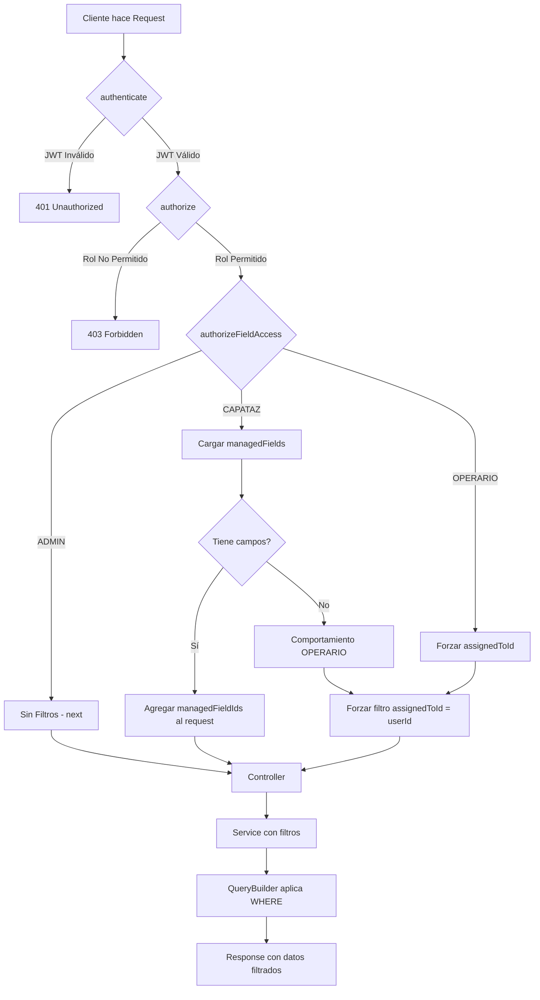

# Diagramas de Flujo - Sistema de Autorización

## Flujo General de Autorización



## Flujo por Rol

### ADMIN - Acceso Total

```
┌─────────────┐
│   REQUEST   │ GET /work-orders
└──────┬──────┘
       │
       ▼
┌─────────────┐
│ authenticate│ ✅ Token válido
└──────┬──────┘
       │
       ▼
┌─────────────┐
│  authorize  │ ✅ ADMIN permitido
└──────┬──────┘
       │
       ▼
┌──────────────────┐
│authorizeFieldAccess│
│                  │
│  role === ADMIN  │
│  return next()   │ ← Sin filtros adicionales
└──────┬──────────┘
       │
       ▼
┌─────────────┐
│ Controller  │ filters = {} (vacío)
└──────┬──────┘
       │
       ▼
┌─────────────┐
│  Service    │ SELECT * FROM work_orders
└──────┬──────┘
       │
       ▼
┌─────────────┐
│  Response   │ 📦 TODAS las OTs
└─────────────┘
```

### CAPATAZ - Filtro por Campos Gestionados

```
┌─────────────┐
│   REQUEST   │ GET /work-orders
└──────┬──────┘
       │
       ▼
┌─────────────┐
│ authenticate│ ✅ Token válido
│             │ req.user = { userId, role: CAPATAZ }
└──────┬──────┘
       │
       ▼
┌──────────────────┐
│authorizeFieldAccess│
│                  │
│ 1. Cargar User   │
│    + managedFields│ ← SELECT * FROM users 
│                  │   LEFT JOIN fields ON fields.managerId = users.id
│ 2. Extraer IDs   │
│    [field-A, field-B]
│                  │
│ 3. Agregar al req│
│    req.managedFieldIds = ['field-A', 'field-B']
│                  │
│ 4. return next() │
└──────┬──────────┘
       │
       ▼
┌─────────────┐
│ Controller  │ filters = {
│             │   managedFieldIds: ['field-A', 'field-B'],
│             │   assignedToId: 'capataz-001'
└──────┬──────┘ }
       │
       ▼
┌─────────────┐
│  Service    │ QueryBuilder:
│             │ WHERE (
│             │   plots.fieldId IN ('field-A', 'field-B')
│             │   OR assignedToId = 'capataz-001'
│             │ )
└──────┬──────┘
       │
       ▼
┌─────────────┐
│  Response   │ 📦 Solo OTs de campos gestionados + asignadas
└─────────────┘
```

### OPERARIO - Solo OTs Asignadas

```
┌─────────────┐
│   REQUEST   │ GET /work-orders
└──────┬──────┘
       │
       ▼
┌─────────────┐
│ authenticate│ ✅ Token válido
│             │ req.user = { userId, role: OPERARIO }
└──────┬──────┘
       │
       ▼
┌──────────────────┐
│authorizeFieldAccess│
│                  │
│ 1. Verificar rol │
│    role === OPERARIO
│                  │
│ 2. Forzar filtro │
│    req.query.assignedToId = userId
│                  │
│ 3. Validar byp|  │
│    if (req.query.assignedToId !== userId)
│      throw 403   │ ← Previene bypass
│                  │
│ 4. return next() │
└──────┬──────────┘
       │
       ▼
┌─────────────┐
│ Controller  │ filters = {
│             │   assignedToId: 'operario-001'
└──────┬──────┘ }
       │
       ▼
┌─────────────┐
│  Service    │ QueryBuilder:
│             │ WHERE assignedToId = 'operario-001'
└──────┬──────┘
       │
       ▼
┌─────────────┐
│  Response   │ 📦 Solo OTs asignadas al operario
└─────────────┘
```

## Validación de Acceso a Recurso Específico

### Ejemplo: GET /plots/:id

```
┌─────────────┐
│   REQUEST   │ GET /plots/plot-B1
│             │ Usuario: CAPATAZ (gestiona field-A)
└──────┬──────┘
       │
       ▼
┌──────────────────┐
│authorizeFieldAccess│
│                  │
│ 1. Es ADMIN?     │ → No
│                  │
│ 2. Es CAPATAZ?   │ → Sí
│                  │
│ 3. Tiene params? │ → Sí (req.params.id = 'plot-B1')
│                  │
│ 4. Es ruta /plots/? → Sí
│                  │
│ 5. Buscar Plot   │ ← SELECT * FROM plots WHERE id = 'plot-B1'
│    plot = { id: 'plot-B1', fieldId: 'field-B' }
│                  │
│ 6. Validar acceso│
│    managedFieldIds.includes(plot.fieldId)
│    ['field-A'].includes('field-B')
│    → false       │
│                  │
│ 7. throw 403     │ ❌ FORBIDDEN
└──────────────────┘
       │
       ▼
┌─────────────┐
│  Response   │ 403 - No tienes permisos para acceder a esta parcela
└─────────────┘
```

## Estructura de Datos

### Request Object (después de middlewares)

```typescript
req = {
  user: {
    userId: "capataz-001",
    email: "capataz@test.com",
    role: "CAPATAZ",
    name: "Juan",
    lastName: "Capataz"
  },
  managedFieldIds: ["field-A", "field-B"], // ← Agregado por authorizeFieldAccess
  query: {
    status: "PENDING",
    assignedToId: "capataz-001" // ← Puede ser forzado para OPERARIO
  },
  params: {
    id: "wo-001"
  }
}
```

### Filters Object (en Service)

```typescript
// ADMIN
filters = {} // Sin filtros

// CAPATAZ con campos
filters = {
  status: "PENDING",
  managedFieldIds: ["field-A", "field-B"],
  assignedToId: "capataz-001"
}

// OPERARIO
filters = {
  assignedToId: "operario-001" // Forzado
}
```

## Queries Generados

### Sin Filtros (ADMIN)

```sql
SELECT 
  workOrder.*,
  user.*,
  plots.*
FROM work_orders workOrder
LEFT JOIN users user ON workOrder.assignedToId = user.id
LEFT JOIN work_order_plots ON workOrder.id = work_order_plots.workOrderId
LEFT JOIN plots ON work_order_plots.plotId = plots.id
ORDER BY workOrder.createdAt DESC
```

### Con managedFieldIds (CAPATAZ)

```sql
SELECT 
  workOrder.*,
  user.*,
  plots.*
FROM work_orders workOrder
LEFT JOIN users user ON workOrder.assignedToId = user.id
LEFT JOIN work_order_plots ON workOrder.id = work_order_plots.workOrderId
LEFT JOIN plots ON work_order_plots.plotId = plots.id
WHERE (
  plots.fieldId IN ('field-A', 'field-B')  -- Campos gestionados
  OR workOrder.assignedToId = 'capataz-001'  -- O asignadas a él
)
ORDER BY workOrder.createdAt DESC
```

### Solo assignedToId (OPERARIO)

```sql
SELECT 
  workOrder.*,
  user.*,
  plots.*
FROM work_orders workOrder
LEFT JOIN users user ON workOrder.assignedToId = user.id
LEFT JOIN work_order_plots ON workOrder.id = work_order_plots.workOrderId
LEFT JOIN plots ON work_order_plots.plotId = plots.id
WHERE workOrder.assignedToId = 'operario-001'  -- Solo sus OTs
ORDER BY workOrder.createdAt DESC
```

## Tabla de Decisiones

| Rol | Tiene managedFields | Query assignedToId | Filtro Aplicado |
|-----|---------------------|-------------------|-----------------|
| ADMIN | N/A | No | Sin filtros |
| CAPATAZ | Sí | query.assignedToId | `(fieldId IN [...] OR assignedToId = userId)` |
| CAPATAZ | No | Forzado userId | `assignedToId = userId` |
| OPERARIO | N/A | Forzado userId | `assignedToId = userId` |

## Casos Edge

### CAPATAZ intenta bypass con assignedToId diferente

```
Request: GET /work-orders?assignedToId=otro-usuario
Middleware: req.query.assignedToId ya está presente
Result: Se mantiene el filtro existente
Comportamiento: ✅ OK - Ve OTs de ese usuario SOLO si están en sus campos
```

### OPERARIO intenta bypass con assignedToId diferente

```
Request: GET /work-orders?assignedToId=otro-usuario
Middleware: Valida que req.query.assignedToId !== userId
Result: throw HttpException(403, "Un operario solo puede ver sus propias órdenes")
Comportamiento: ❌ FORBIDDEN
```

### CAPATAZ sin managedFields

```
Usuario: CAPATAZ con managedFields = []
Middleware: Detecta managedFieldIds.length === 0
Comportamiento: Se comporta como OPERARIO
Result: Solo ve OTs asignadas a él
```

## Referencias

- **Implementación**: `src/middlewares/authorize-field-access.middleware.ts`
- **Guía de uso**: `docs/AUTHORIZATION_GUIDE.md`
- **Testing**: `docs/AUTHORIZATION_TESTING.md`
